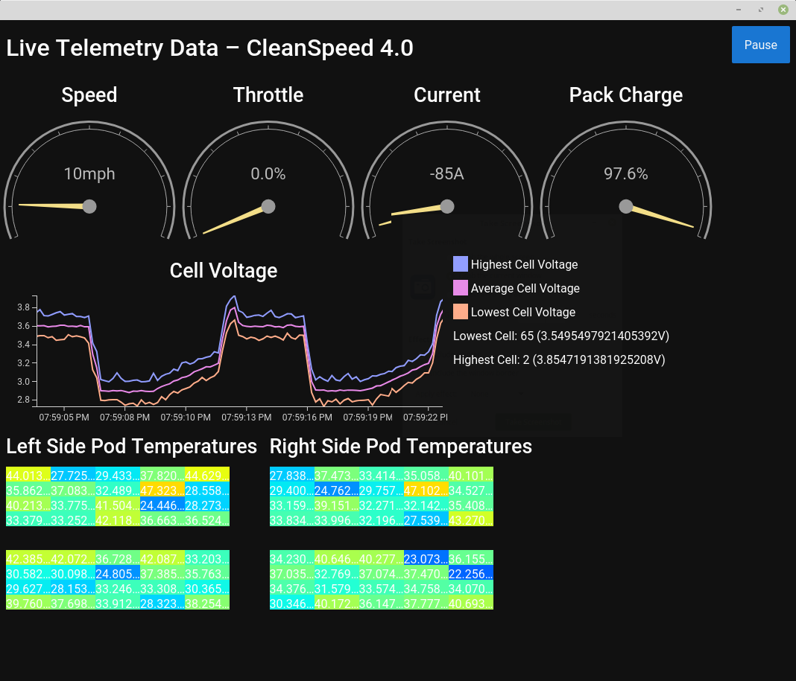

# AERO DAQ Live Data Visualizer

## AERO DAQ
AERO DAQ is a University of Vermont Engineering Capstone Project (SEED) team for the 2018-2019 academic year that is desiging a data acquisition system (DAQ) for AERO (Alternative Energy Racing Organization). The team consists of Senior AERO members Cullen Jemison, Jack Zimmerman, Peter Ferland, and Ryan Chevalier.

## Purpose
This program serves as the live frontend to the AERO DAQ project. It displays select data that is remotely transmitted from the car to a set of gauges and graphs. It allows for team members in the pit to view the current status of the car so they can inform the driver of any changes that need to be made to their driving style.

## Structure
The program consists of a Python server using [Twisted](https://github.com/twisted/twisted) and a frontend/web GUI written in Javascript/HTML that utilizes the [Epoch](https://github.com/epochjs/epoch) live graphing library to generate the gauges and graphs.

The Python server directly reads data from the car and presents a network endpoint that returns a single large JSON blob containing all the data when accessed via HTTP POST.

The Javascript frontend uses AJAX to request data from the server on a regular interval. The JSON data is parsed and used to update all the graphs and gauges on the page.

## Usage
Note: This process will be streamlined in the future. Also, more dependencies will be added as the code is fleshed out.

Currently, this has only been tested on Linux. Some differences may exist in the setup process for Windows or MacOS.

1. Install the dependencies. This program requires Python 3.6+ as well as the Twisted networking library.

To install Twisted, use:
`pip install Twisted`

2. Get the source code by either downloading the zip or using:
`git clone https://github.com/uvmaero/aero-daq-live-visualizer`

3. Run the program using run.sh. This will start the Twisted server and open your preferred browser with the GUI.

4. To close the program cleanly, click the "Close" button on the Web GUI.